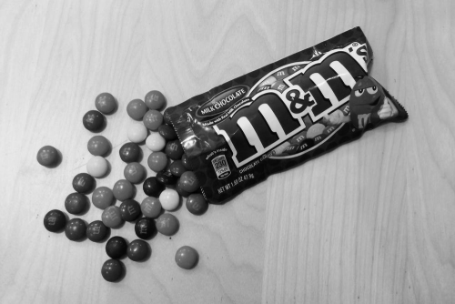
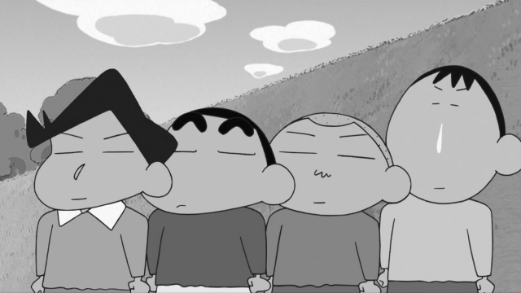
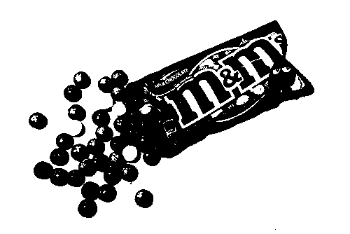
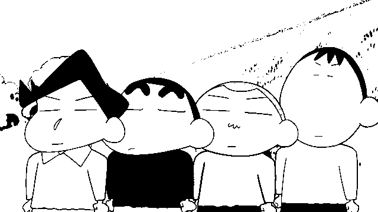
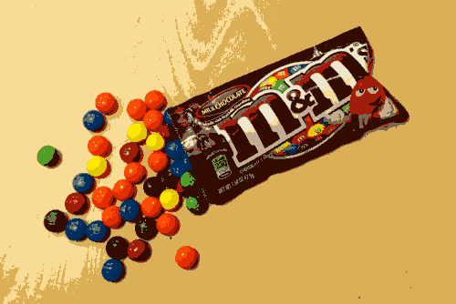
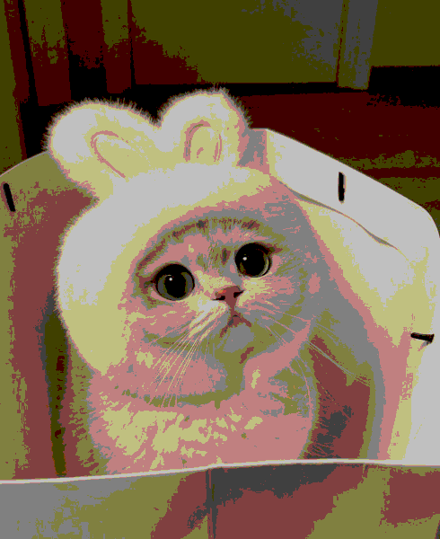
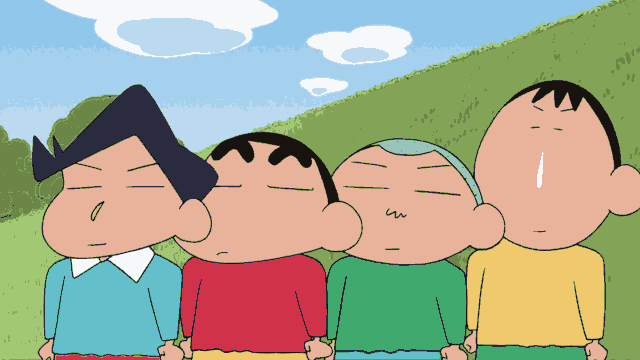
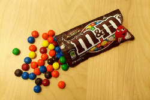
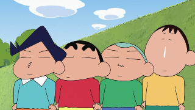

# MV HW1 Report

資工三 110590004 林奕廷

## Requirements

```toml
python = ">=3.8,<4"
opencv-python = "^4.9.0.80"
alive-progress = "^3.1.5"
```

## Usage

```bash
python main.py
```

## Q1

+ P1: 遍歷所有 pixel 並依照給定公式 (0.3 × 𝑅) + (0.59 × 𝐺) + (0.11 × 𝐵) 直接轉換，須注意 OpenCV 使用 BGR 而非 RGB\



+ P2: 使用 P1 產生的圖片並隨意地使用 128 作為閾值，遍歷所有 pixel 進行二值化\



+ P3:
+ Method 1 (abandoned), can bd found in the function `P3A` in `main.py`
  + 以 `DIVS*DIVS` 的尺寸對整張圖片進行採樣，以降低複雜度，須對 pixel 進行轉型否則預設的 `uint8` 在運算過程中會溢位
  + 在採樣的過程中維護一個 `List[ColorPool]`，每個 `ColorPool` 維護一個與   `ColorPool.MainColor `差距在 `THRESH` 以內的顏色，並記錄各自的出現次數
  + 當某個顏色不屬於 `List[ColorPool]` 中的任一一個 `ColorPool` 創建屬於他自己的 `ColorPool`
  + 遍歷結束後把 `List[ColorPool]` 依照 `Pool.Size` 進行排序，並把 `ColorPool` 的顏色出現次數排序
  + 重複遍歷  `List[ColorPool]` 並從裡面取出出現次數最高的顏色直到拿出 16 個顏色至調色盤
  + 遍歷所有 pixel 並替換成與調色盤最近的顏色
  + 每張圖片各自的 ColorMap
    + img1: <span style="color: #f9dc96;">#f9dc96 <span style="color: #dbaf56;">#dbaf56 <span style="color: #200401;">#200401 <span style="color: #846031;">#846031 <span style="color: #9c1501;">#9c1501 <span style="color: #1e597a;">#1e597a <span style="color: #f8e20c;">#f8e20c <span style="color: #ab0601;">#ab0601 <span style="color: #65523e;">#65523e <span style="color: #a69277;">#a69277 <span style="color: #f74f0e;">#f74f0e <span style="color: #1e2e3d;">#1e2e3d <span style="color: #e0970a;">#e0970a <span style="color: #278a06;">#278a06 <span style="color: #607a75;">#607a75 <span style="color: #ede4c4;">#ede4c4\
    + img2: <span style="color: #dfcdbf;">#dfcdbf <span style="color: #645335;">#645335 <span style="color: #998678;">#998678 <span style="color: #e2d2c3;">#e2d2c3 <span style="color: #1d0902;">#1d0902 <span style="color: #b57062;">#b57062 <span style="color: #d9c7b9;">#d9c7b9 <span style="color: #635234;">#635234 <span style="color: #9c897b;">#9c897b <span style="color: #e1d1c2;">#e1d1c2 <span style="color: #1a0903;">#1a0903 <span style="color: #625133;">#625133 <span style="color: #938072;">#938072 <span style="color: #e0d0c1;">#e0d0c1 <span style="color: #2e1b02;">#2e1b02 <span style="color: #503c21;">#503c21\
    + img3:<span style="color: #729d3d;">#729d3d <span style="color: #82a45b;">#82a45b <span style="color: #65c3ca;">#65c3ca <span style="color: #e8b098;">#e8b098 <span style="color: #1c1d45;">#1c1d45 <span style="color: #f7f9f9;">#f7f9f9 <span style="color: #3fad6f;">#3fad6f <span style="color: #d03149;">#d03149 <span style="color: #f2c66a;">#f2c66a <span style="color: #6f5548;">#6f5548 <span style="color: #755b51;">#755b51 <span style="color: #aa746b;">#aa746b <span style="color: #eaf378;">#eaf378 <span style="color: #358555;">#358555 <span style="color: #090909;">#090909 <span style="color: #752833;">#752833\
+ Method 2
  + 選擇一個好的隨機種子
  + 將圖片中所有 pixel 進行隨機打亂，並遍歷所有的pixel
  + 若所有的調色盤的代表顏色距離給定顏色的距離都大於給定的閾值且調色盤數量不足 16 ，則將該顏色加入調色盤，否則將此顏色加進與其最近的調色盤中，並更新該調色盤的代表色。
  + 適時更新閾值已達到更好的效果
  + 遍歷所有原圖的 pixel 並替換成與調色盤最近的顏色
  + 每張圖片各自的 color map
  + img1: <span style="color: #f8dd93;">#f8dd93 </span><span style="color: #ddb25a;">#ddb25a </span><span style="color: #2e1005;">#2e1005 </span><span style="color: #583117;">#583117 </span><span style="color: #740b03;">#740b03 </span><span style="color: #164370;">#164370 </span><span style="color: #ee4209;">#ee4209 </span><span style="color: #e6d9bb;">#e6d9bb </span><span style="color: #cfa148;">#cfa148 </span><span style="color: #873b13;">#873b13 </span><span style="color: #1c7e0f;">#1c7e0f </span><span style="color: #ecc975;">#ecc975 </span><span style="color: #b81c06;">#b81c06 </span><span style="color: #b8a787;">#b8a787 </span><span style="color: #94703a;">#94703a </span><span style="color: #e8cc05;">#e8cc05 </span>\
    
  + img2:  <span style="color: #8e7662;">#8e7662 </span><span style="color: #ead8c6;">#ead8c6 </span><span style="color: #c1ab94;">#c1ab94 </span><span style="color: #816954;">#816954 </span><span style="color: #503c20;">#503c20 </span><span style="color: #6d593e;">#6d593e </span><span style="color: #dec8b5;">#dec8b5 </span><span style="color: #a38f7d;">#a38f7d </span><span style="color: #5e4b2f;">#5e4b2f </span><span style="color: #1e0d05;">#1e0d05 </span><span style="color: #443112;">#443112 </span><span style="color: #d2b89d;">#d2b89d </span><span style="color: #b79e85;">#b79e85 </span><span style="color: #c9b8a9;">#c9b8a9 </span><span style="color: #9a816b;">#9a816b </span><span style="color: #322008;">#322008 </span>\
    
  + img3:<span style="color: #bbd9ef;">#bbd9ef </span><span style="color: #2a2b3e;">#2a2b3e </span><span style="color: #e8b29b;">#e8b29b </span><span style="color: #a59b68;">#a59b68 </span><span style="color: #19130f;">#19130f </span><span style="color: #63bfc9;">#63bfc9 </span><span style="color: #a3c874;">#a3c874 </span><span style="color: #a5d1ee;">#a5d1ee </span><span style="color: #f0c96c;">#f0c96c </span><span style="color: #f6f8f9;">#f6f8f9 </span><span style="color: #83a456;">#83a456 </span><span style="color: #99c4ba;">#99c4ba </span><span style="color: #6b8646;">#6b8646 </span><span style="color: #92c7ec;">#92c7ec </span><span style="color: #3fa96e;">#3fa96e </span><span style="color: #cf3249;">#cf3249 </span>\
    
## Q2

+ P1:
  + 創建一張空的兩倍的圖片並將在原始圖片的每個像素（在` imgs[i]`中的 `row, col`）複製到 `result` 中的四個相鄰像素（在 `row*2, col*2`，`row*2, col*2+1`，`row*2+1, col*2`，和 `row*2+1, col*2+1`）\


  + 創建一張空的二分之一被大小的圖片並將每個像素 使用 `result[row, col] = (imgs[i][row*2, col*2]) `進行替換\



+ P2:
  + 先計算對應 pixel 在原始圖片的相對座標，並進一步對應到在圖中的 pixel 位置，並對邊界座標處理
  + 利用前一步驟得到的座標依照線性插值公式計算出新的 pixel 值
  + 放大\


  + 縮小\


